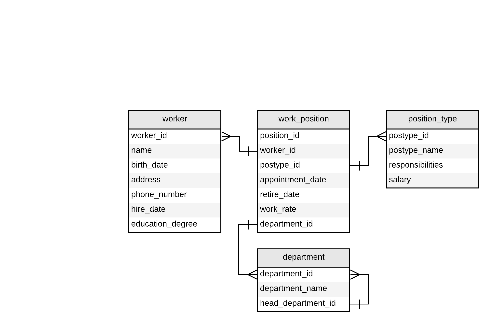

# Структура БД

# Описание набора страниц

(A) - доступно только администратору

1. **Главная страница**
    * Дерево структуры компании (имя + кликабельная ссылка) -> **Страница подразделения**
    * Кнопка 'Вакансии' -> **Страница вакансий**
    * Кнопка 'Работники' (А) -> **Общая страница работников**
    * Кнопка 'Должности' (А) -> **Страница должностей**
    * Кнопка 'Добавить подразделение' (А) -> **Cтраница для изменения (добавления) подразделения**
    * Кнопка 'Изменить' рядом с каждым подразделением (А) -> **Cтраница для изменения (добавления) подразделения**
    * Кнопка 'Удалить' рядом с каждым подразделением (А)

**Рекурсивный SELECT - запрос из таблицы DEPARTMENT**

2. **Страница подразделения**
    * Имя подразделения
    * Головное подразделение (имя + кликабельная ссылка) -> **Страница подразделения**
    * Список дочерних подразделений (имя + кликабельная ссылка) -> **Страница подразделения**
    * Список всех работников подразделения, разбитый по должностям (ФИО + кликабельная ссылка) -> **Страница работника**
    * Кнопка 'Уволить' рядом с каждым работником (А)
    * Кнопка 'Изменить' (А) -> **Cтраница для изменения (добавления) подразделения**
    * Кнопка 'Удалить' (А) -> **Cтраница для изменения (добавления) подразделения**

**DEPARTMENT <=> WORK_POSITION (retire_date = NULL) <=> WORKER**

3. **Страница вакансий**
    * Должность
    * Подразделение
    * Рабочая ставка
    * Обязанности
    * Оклад
    * Кнопка 'Добавить вакансию' (А) -> **Cтраница для изменения (добавления) рабочего места**
    * Кнопка 'Назначить работника' рядом с каждой вакансией (А) -> **Cтраница для изменения (добавления) рабочего места**
    * Кнопка 'Удалить' рядом с каждой вакансией (А)

**WORK_POSITION (worker_id = NULL) <=> POSITION_TYPE <=> DEPARTMENT**

4. **Общая страница работников**
    * Общий список всех работников, как работающих, так и не работающих
    * ФИО + кликабельная ссылка -> **Страница работника**
    * Текущие должность и подразделение
    * Дата найма
    * Сортировка работников по алфавиту, должности, подразделению и дате найма
    * Фильтрация работников по описанным выше параметрам
    * Кнопка 'Добавить работника' (А) -> **Страница для изменения (добавления) работника**

**WORKER <== WORK_POSITION (retire_date = NULL)<== DEPARTMENT**

5. **Страница работника**
    * ФИО
    * Дата рождения
    * Дата найма
    * Учёная степень
    * Номер телефона
    * Место жительства (А)
    * История занимаемых должностей (если есть)
    * Кнопка 'Изменить' (А) -> **Страница для изменения (добавления) работника**
    * Кнопка 'Удалить' (А)

**WORKER <== WORK_POSITION <== DEPARTMENT**

6. **Страница должностей** (А)
    * Наименование должности
    * Обязанности
    * Оклад
    * Кнопка 'Добавить должность' -> **Cтраница для изменения (добавления) должности**
    * Кнопка 'Изменить' рядом с каждой должностью -> **Cтраница для изменения (добавления) должности**
    * Кнопка 'Удалить' рядом с каждой должностью

**POSITION_TYPE**

7. **Страница для изменения (добавления) работника** (А)
    * Редактируемые поля:
        * ФИО
        * Дата рождения
        * Дата найма
        * Учёная степень (выпадающий список)
        * Номер телефона
        * Место жительства
    * Кнопка 'Применить'

8. **Cтраница для изменения (добавления) рабочего места** (А)
    * Редактируемые поля:
        * Работник (выпадающий список)
        * Должность (выпадающий список)
        * Подразделение (выпадающий список)
        * Дата вступления в должность
        * Дата завершения работы в должности
        * Рабочая ставка
    * Кнопка 'Применить'

9. **Cтраница для изменения (добавления) должности** (А)
    * Редактируемые поля:
        * Наименование должности
        * Обязанности
        * Оклад
    * Кнопка 'Применить'

10. **Cтраница для изменения (добавления) подразделения** (А)
    * Редактируемые поля:
        * Имя подразделения
        * Головное подразделение (выпадающий список)
    * Кнопка 'Применить'

# Сценарии использования

1. Получение структуры компании и её редактирование
    * Просмотр структуры компании
        * **Главная страница**
    * Просмотр информации о подразделении
        * **Главная страница** --'Имя подразделения'-> **Страница подразделения**
    * Добавление подразделения в компанию
    * Изменение / удаление информации о подразделении
2. Управление рабочими местами и вакансиями
    * Просмотр вакансий
        * **Главная страница** --'Вакансии'-> **Страница вакансий**
    * Добавление / удаление вакансии
        * **Главная страница** --'Вакансии'-> **Страница вакансий** --'Добавить / удалить'~> **Cтраница для изменения (добавления) рабочего места**
    * Назначение работника на данное место
        * **Главная страница** --'Вакансии'-> **Страница вакансий** --'Назначить работника'-> **Cтраница для изменения (добавления) рабочего места**
    * Просмотр должностей
        * **Главная страница** --'Должности'-> **Страница должностей**
    * Добавление / удаление / изменение должности
        * **Главная страница** --'Должности'-> **Страница должностей** --'Добавить / удалить / изменить'~>**Cтраница для изменения (добавления) должности** (А)
3. Управление списком работников
    * Получение списка работников с фильтрацией по дате найма, подразделению и должности
        * **Главная страница** --'Работники'-> **Общая страница работников** -> Выбор фильтра
    * Получение истории должностей данного работника
        * **Главная страница** --'Работники'-> **Общая страница работников** --'Имя работника'-> **Страница работника** (А)
        * **Главная страница** --'Имя подразделения'-> **Страница подразделения** --'Имя работника'-> **Страница работника**
    * Изменение / удаление информации о работнике
        * --...-> **Страница работника** --'Изменить / удалить'~> **Страница для изменения (добавления) работника**
    * Добавление нового работника в список
        * --...-> **Общая страница работников** --'Добавить'-> **Страница для изменения (добавления) работника**
    * Назначение работника на новую должность
        * Делается через назначение работника на вакансию, либо через страницу создания новой вокансии (порядок тот же) (Дата завершения работы в должности проставляется автоматически)
    * Увольнение работника
        * **Главная страница** --'Имя подразделения'-> **Страница подразделения** --'Уволить'->

